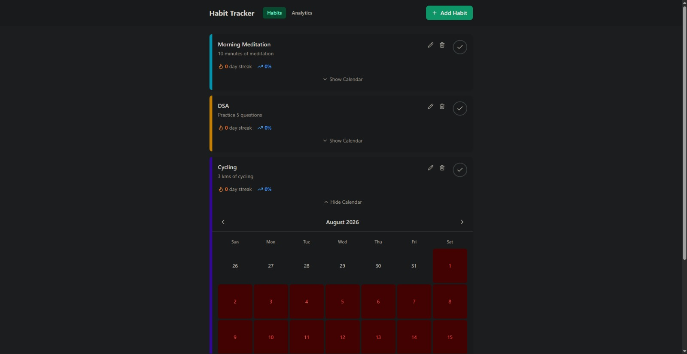
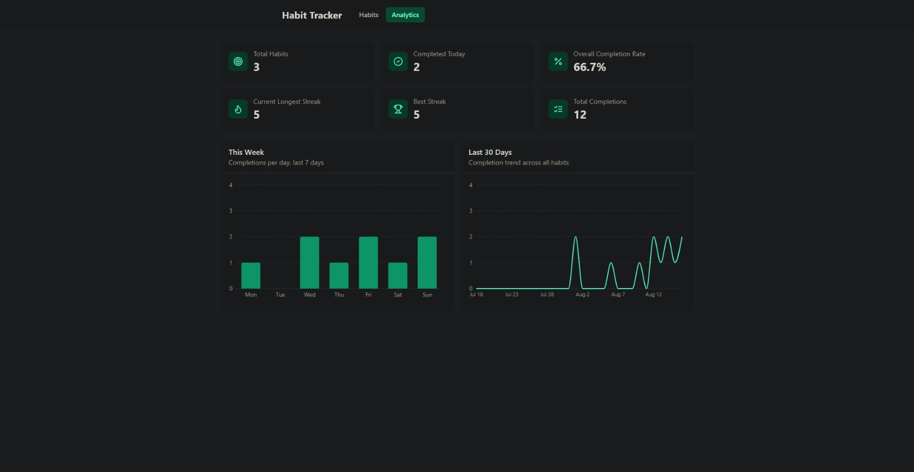

# Habit Tracker

A full-stack habit tracking application for building consistent daily habits through streak tracking, completion history, calendar visualization, and progress analytics.

Built with **React, Vite, Tailwind CSS, FastAPI, SQLAlchemy, and SQLite**, the application provides a responsive interface for managing habits while keeping business logic and analytics on the backend.

## Screenshots

### Habit Dashboard

Manage daily habits, track streaks, mark completions, and review completion history through the built-in calendar.

<p align="center">
  
</p>

### Analytics Dashboard

Monitor overall habit performance through completion statistics, weekly activity, and 30-day completion trends.

<p align="center">
  
</p>

## Features

* **Habit Management** — Create, edit, archive, and delete habits.
* **Daily Completion Tracking** — Mark habits complete for a specific day.
* **Streak Tracking** — Track current and longest streaks for each habit.
* **Planned Skips** — Record planned absence days without treating them as missed habit days.
* **Calendar View** — Review completion history through a monthly calendar.
* **Analytics Dashboard** — View aggregated habit performance and completion statistics.
* **Weekly Analytics** — Analyze completion activity across the previous 7 days.
* **30-Day Trends** — Visualize completion activity across the previous 30 days.
* **Responsive UI** — React and Tailwind CSS interface designed for desktop and mobile screens.
* **REST API** — FastAPI backend with automatically generated OpenAPI documentation.
* **Data Validation** — Pydantic schemas for validating API requests and responses.
* **Automated Testing** — Backend API and streak calculation tests using Pytest and HTTPX.
* **Structured Logging** — Backend logging configured with `structlog`.

## Architecture

The application follows a straightforward client-server architecture with a clear separation between the frontend, API layer, and database.

```text
┌──────────────────────────┐
│       React + Vite       │
│         Frontend         │
│                          │
│  Habits · Calendar       │
│  Analytics · UI          │
└────────────┬─────────────┘
             │
             │ HTTP / JSON
             ▼
┌──────────────────────────┐
│         FastAPI          │
│          REST API        │
│                          │
│ Habits · Completions     │
│ Analytics · Health       │
└────────────┬─────────────┘
             │
             │ SQLAlchemy
             ▼
┌──────────────────────────┐
│          SQLite          │
│                          │
│ Habits · Completions     │
└──────────────────────────┘
```

The frontend is responsible for presentation and user interaction, while the FastAPI backend handles validation, persistence, streak calculations, and analytics.

## Analytics

The analytics dashboard provides an overview of habit performance, including:

* Total habits
* Habits completed today
* Overall completion rate
* Current longest streak
* Best streak
* Total completions
* Weekly completion activity
* 30-day completion trends

The dashboard combines aggregate statistics with time-series data to provide both a high-level overview and a view of recent activity.

## Streak Tracking

Streak calculations are handled by the backend using completion history.

A habit's statistics include:

* Current streak
* Longest streak
* Total completions
* Completion rate

Planned skips are handled separately from missed days so that intentionally skipped dates can be represented without being treated as completed or accidentally changing the meaning of completion history.

## Tech Stack

| Layer                         | Technology      |
| ----------------------------- | --------------- |
| Frontend                      | React 18        |
| Build Tool                    | Vite            |
| Styling                       | Tailwind CSS    |
| Data Fetching                 | TanStack Query  |
| Routing                       | React Router    |
| Charts                        | Recharts        |
| Icons                         | Lucide React    |
| Backend                       | Python, FastAPI |
| ORM                           | SQLAlchemy      |
| Validation                    | Pydantic        |
| Database                      | SQLite          |
| Logging                       | Structlog       |
| Testing                       | Pytest, HTTPX   |
| Coverage                      | pytest-cov      |
| Python Package Management     | uv              |
| JavaScript Package Management | npm             |

## Project Structure

```text
habit-tracker/
├── backend/
│   ├── app/
│   │   ├── main.py
│   │   ├── database.py
│   │   ├── models.py
│   │   ├── schemas.py
│   │   └── routers/
│   │       ├── habits.py
│   │       ├── completions.py
│   │       └── analytics.py
│   │
│   └── tests/
│       ├── test_api_habits.py
│       ├── test_api_completions.py
│       ├── test_api_analytics.py
│       └── test_streak.py
│
├── frontend/
│   ├── public/
│   │   └── screenshots/
│   │       ├── dashboard.png
│   │       └── analytics.png
│   │
│   ├── src/
│   │   ├── components/
│   │   ├── features/
│   │   │   ├── habits/
│   │   │   ├── calendar/
│   │   │   └── analytics/
│   │   ├── pages/
│   │   └── lib/
│   │
│   └── package.json
│
├── .gitignore
└── README.md
```

## API

### Health

| Method | Endpoint  | Description      |
| ------ | --------- | ---------------- |
| GET    | `/health` | Check API health |

### Habits

| Method | Endpoint           | Description                 |
| ------ | ------------------ | --------------------------- |
| GET    | `/api/habits`      | List habits with statistics |
| POST   | `/api/habits`      | Create a habit              |
| PUT    | `/api/habits/{id}` | Update a habit              |
| DELETE | `/api/habits/{id}` | Delete a habit              |

### Completions

| Method | Endpoint                              | Description                 |
| ------ | ------------------------------------- | --------------------------- |
| POST   | `/api/habits/{id}/complete`           | Mark a habit complete       |
| DELETE | `/api/habits/{id}/completions/{date}` | Remove a completion         |
| GET    | `/api/habits/{id}/completions`        | Retrieve completion history |

### Analytics

| Method | Endpoint         | Description                         |
| ------ | ---------------- | ----------------------------------- |
| GET    | `/api/analytics` | Retrieve aggregated habit analytics |

FastAPI automatically provides interactive API documentation during development:

```text
http://localhost:8000/docs
```

## Getting Started

### Prerequisites

Make sure the following are installed:

* Python 3.11+
* uv
* Node.js 18+
* npm

### 1. Clone the repository

```bash
git clone https://github.com/Shwetanjsrey/habit-tracker.git
cd habit-tracker
```

### 2. Start the backend

```bash
cd backend
uv sync
uv run uvicorn app.main:app --reload --port 8000
```

The backend will be available at:

```text
http://localhost:8000
```

Interactive API documentation:

```text
http://localhost:8000/docs
```

### 3. Start the frontend

Open another terminal:

```bash
cd frontend
npm install
npm run dev
```

The frontend will be available at:

```text
http://localhost:5173
```

## Testing

Backend tests are located in `backend/tests`.

Run the complete test suite:

```bash
cd backend
uv run pytest
```

Run tests with coverage:

```bash
uv run pytest --cov=app
```

The test suite covers API behavior, completion handling, analytics endpoints, and streak calculation logic.

## Code Quality

### Backend linting

```bash
cd backend
uv run ruff check .
```

### Frontend linting

```bash
cd frontend
npm run lint
```

### Frontend production build

```bash
cd frontend
npm run build
```

## Database

The application uses **SQLite** for local persistence with **SQLAlchemy** as the ORM.

The database stores the application's habit and completion data while SQLAlchemy provides the database abstraction used by the FastAPI backend.

SQLite keeps the project lightweight for local development without requiring a separate database server.

## Development

The application is split into independent frontend and backend projects.

During local development:

```text
Frontend
http://localhost:5173

        │
        │ HTTP / JSON
        ▼

Backend
http://localhost:8000

        │
        │ SQLAlchemy
        ▼

SQLite
habits.db
```

This separation allows the frontend and backend to be developed, tested, and deployed independently.

## Deployment

The frontend is configured as a Vite single-page application and can be deployed to a static hosting platform such as Vercel.

The FastAPI backend can be deployed separately to a Python-compatible hosting platform.

For production deployments, environment-specific configuration should be supplied through deployment environment variables rather than hard-coded into the application.

SQLite is suitable for local development and lightweight deployments. A managed relational database can be introduced for deployments requiring multiple application instances or more extensive persistent storage.

## Engineering Focus

This project focuses on implementing a complete full-stack workflow rather than building a frontend-only interface.

Key areas include:

* REST API design
* Relational data modeling
* Backend business logic
* Input and response validation
* Database persistence
* Streak calculation
* Analytics aggregation
* Client-side data fetching
* Data visualization
* Automated backend testing
* Code quality and linting
* Frontend production builds
* Independent frontend and backend deployment

## Project Status

Habit Tracker is a functional full-stack application with working habit management, completion tracking, streak calculations, calendar visualization, analytics, REST APIs, and automated backend tests.
